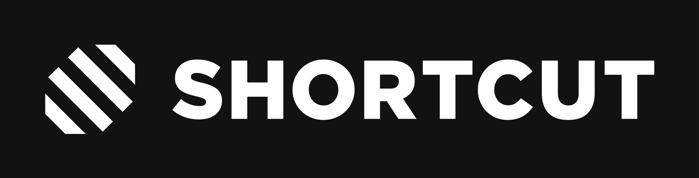

# The Shortcutter's Coding Challenge

Hi :wave:

This document describes the challenge for those interested in working with us. As you may have guessed, it revolves around the backend. :tada:

## URL Shortener
Develop a service that lets users create short URLs (like Bitly, Rebrandly, etc.) for their original links.

Consider this as MVP that is ready for deployment, but try to keep in mind future maintenance and improvements.
Don't spend too much time on perfecting it, as long as you can discuss the choices you made, what parts could be improved, etc.

## Functional requirements

- Service should let users register a new account and authenticate themselves.
- Service should let authenticated users create shortened URLs.
- Service should let any user use shortened URLs (e.g., follow redirects to original URLs).

## Technical requirements

- Service has to serve requests over HTTP API.
- We don't expect UI for this task.
- User registration could be very simple with just a login(email) and password.
- You can use any tech solution for storing data but consider that your project has to be easy to launch. For example, if you use any DB consider including deploy scripts or containerization scripts.
- The same rule for dependencies and libraries. If you use packages that other people are unlikely to have, consider including deploy or containerization scripts.

## The README

Please include README file to your project. Hopefully it will contain following information:

- Start from the task and solution description.
- Include instructions how to run or deploy your solution.
- Describe your technical choices and architecture.
- Add details about trade-offs you have made
- Add details about things and features you have skipped, or you would like to change if you have additional time for this project.

## Handing over for review

Please build the project in an open repository on GitHub and deliver the coding challenge via link to the repository.

## The Review

During the review process we'll look at:

- We've been able to run your project.
- Your VCS history, with hopefully more than 1 commit
- The project structure.
- The code architecture.
- Unit & integration tests.
- Good coding practices.
- Consistent coding style and formatting
- Names and naming conventions.
- Good use of comments.
- Lint warnings and code smells.

## The End

We don't like goodbyes, so why not stay in touch? Follow us on LinkedIn
[:norway:](https://no.linkedin.com/company/shortcut-as)
[:denmark:](https://www.linkedin.com/company/shortcut-global/)
[:romania:](https://www.linkedin.com/company/shortcut-bucharest/)
[:sweden:](https://www.linkedin.com/company/shortcut-sweden)
We also appreciate any feedback you may have regarding this coding assignment, good or bad. Send an email to [post@shortcut.no](mailto:post@shortcut.no) and let us know how we're doing!
